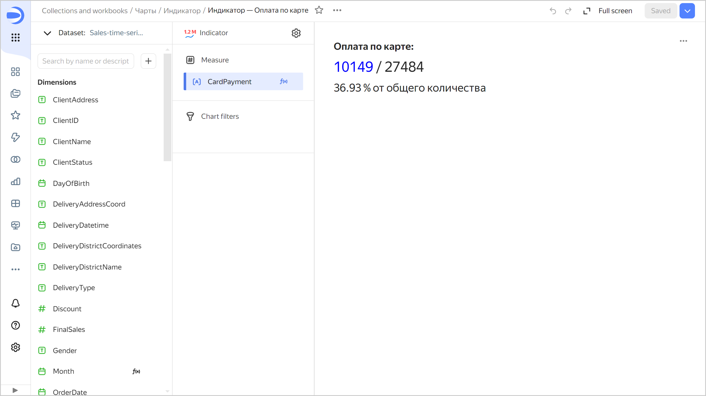
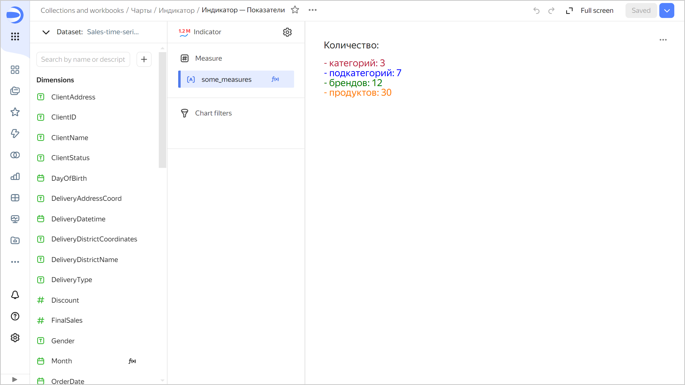
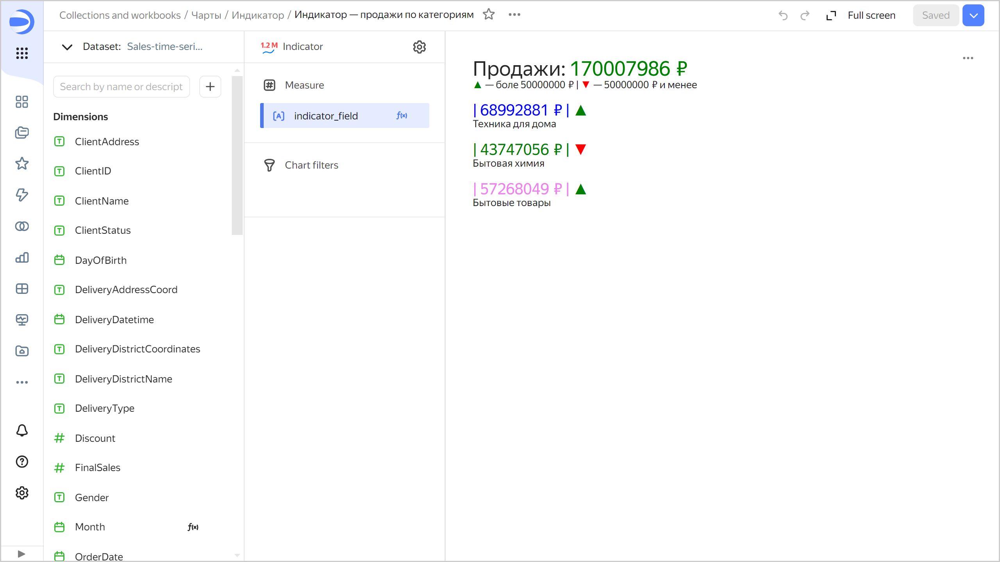

# Indicator 

An indicator reflects the value of a single key measure. You can use several measures to build a more [complex](#markup-indicator) and meaningful indicator.

You may want to use indicators when a dashboard contains values you need to monitor on a regular basis to understand the general picture. This could be, for example, the number of incidents for the previous day, plan performance percentage, or year-on-year sales growth.

Indicators are most commonly placed at the top or on the right side of a dashboard. Put no more than six indicators per screen so they remain in focus without confusing the user. Use indicators of different sizes to build a hierarchy of metrics according to their significance.


You can set up the size and color of an indicator.




Year |	Sales|	
-----|---------| 
2022|	6M |	
2021|	28M |	
2020|	18M |	
2019|	9M | 
2018|	1M |



## Wizard sections {#wizard-sections}

Section<br/> section| Description
----- | ----
Measure  | Measure. One measure that determines the indicator value.
Filters | Dimension or measure. Used as a filter.

## Creating an indicator {#create-diagram}

To create an indicator:





1. Go to the {{ datalens-short-name }} [home page]({{ link-datalens-main }}).
1. In the left-hand panel, select  **Charts**.
1. Click **Create chart** → **Chart**.
1. At the top left, click  **Select dataset** and specify the dataset to visualize.
1. Select the **Indicator** chart type.
1. Drag a dimension or measure from the dataset to the **Measure** section. The value is displayed as a number.

## Additional settings {#additional-settings}

### Changing indicator size and color {#size-color-setting}

To change indicator size and color:

1. In the **Measure** section, click .
1. In the **Indicator settings** window, select the size and color and click **Apply**.

### Customizing header display {#indicator-title}

To customize header display:

1. At the top of the screen, click  next to the chart type.
1. Select header display options:

   * `Field name`: Show field name in header.
   * `Manually`: Rename header.
   * `Hide`: Hide header.

1. Click **Apply**.






### Creating a complex indicator {#markup-indicator}

To create a complex indicator representing a number of measures, use the [markup functions](../function-ref/markup-functions.md). To do this:

1. Create a [calculated field](../concepts/calculations/index.md) using the markup functions.
1. Drag a field from **Measures** to the indicator's **Measure** section.



```markdown
MARKUP(
    BOLD(SIZE('Payment by card: ', '18px')),
    BR(),
    BR(),
    SIZE(COLOR(STR(COUNTD_IF([OrderID], [PaymentType]='Bank card')),'blue') + ' / ' + STR(COUNTD([OrderID])), '26px'),
    BR(),
    BR(),
    SIZE(STR(ROUND(COUNTD_IF([OrderID], [PaymentType]='Bank card')/COUNTD([OrderID])*100, 2)) +
    ' % of total', '20px')
)
```







```markdown
MARKUP(
    SIZE('Amount: ', '18px'),
    BR(),
    BR(),
    COLOR(SIZE('- categories: ' + STR(COUNTD([ProductCategory])), '18px'), '#BE2443'),
    BR(),
    COLOR(SIZE('- subcategories: ' + STR(COUNTD([ProductSubcategory])), '18px'), 'blue'),
    BR(),
    COLOR(SIZE('- brands: ' + STR(COUNTD([ProductBrend])), '18px'), 'green'),
    BR(),
    COLOR(SIZE('- products: ' + STR(COUNTD([ProductName])), '18px'), '#FF7E00')
)
```







```markdown
MARKUP(
    SIZE('Sales: ' + COLOR(STR([Sales])+ ' ₽', 'green'), '26px'),
    BR(),
    COLOR(" ▲ ", "green")+": More than ₽50,000,000  | " + COLOR(" ▼ ", "red") + ": ₽50,000,000 or less",
    BR(),
    BR(),
    SIZE(
        COLOR('| ' + STR(SUM_IF([Sales],[ProductCategory]='Home appliances'))+ ' ₽ | ', 'blue') + 
        COLOR(if(SUM_IF([Sales],[ProductCategory]='Home appliances')>50,000,000, " ▲ "," ▼ "), if(SUM_IF([Sales],[ProductCategory]='Home appliances')>50,000,000,"green", "red")),
        '20px'),
    BR() + 'Home appliances',
    BR(),
    BR(),
    SIZE(
        COLOR('| ' + STR(SUM_IF([Sales],[ProductCategory]='Household chemicals'))+ ' ₽ | ', 'green') + 
        COLOR(if(SUM_IF([Sales],[ProductCategory]='Household chemicals')>50,000,000, " ▲ "," ▼ "), if(SUM_IF([Sales],[ProductCategory]='Household chemicals')>50,000,000,"green", "red")),
        '20px'),
    BR() + 'Household chemicals',
    BR(),
    BR(),
    SIZE(
        COLOR('| ' + STR(SUM_IF([Sales],[ProductCategory]='Household products'))+ ' ₽ | ', 'violet') + 
        COLOR(if(SUM_IF([Sales],[ProductCategory]='Household products')>50,000,000, " ▲ "," ▼ "), if(SUM_IF([Sales],[ProductCategory]='Household products')>50,000,000,"green", "red")),
        '20px'),
    BR() + 'Household products'
)
```





## Recommendations {#recommendations}

* Use emojis when calculating indicator values to make them more informative.

  

  This indicator chart uses a calculated field with the following formula: `IF([Average spend]>2200, CONCAT("✔️",STR(ROUND([Average spend]))),CONCAT("🔻",STR(round([Average spend]))))`.

* Describe the context to make it clear what indicators mean.

  

#### See also {#see-also}

* [{#T}](../operations/dashboard/create.md)
* [{#T}](../operations/dashboard/add-chart.md)
* [{#T}](../operations/dashboard/add-selector.md)